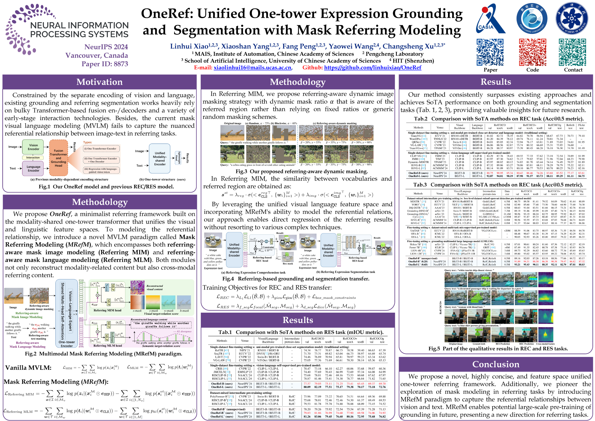

# OneRef
[**[NeurIPS 2024] OneRef: Unified One-tower Expression Grounding and Segmentation with Mask Referring Modeling.**](https://neurips.cc/virtual/2024/poster/93378)

<p align="center">  </p>

 **<p align="center"> [**NeurIPS 2024 OneRef Poster**](https://neurips.cc/virtual/2024/poster/93378)  </p>**


The code is currently being tidied up, and both the code and model will be made publicly available soon!


<h3 align="left">
Links: 
<a href="https://arxiv.org/abs/2410.08021">ArXiv</a>, 
<a href="https://neurips.cc/virtual/2024/poster/93378">NeurIPS 2024</a>
</h3>

## Citation

If you find our work helpful for your research, please consider citing the following BibTeX entry.   

```bibtex
@inproceedings{xiao2024oneref,
  title={OneRef: Unified One-tower Expression Grounding and Segmentation with Mask Referring Modeling},
  author={Xiao, Linhui and Yang, Xiaoshan and Peng, Fang and Wang, Yaowei and Xu, Changsheng},
  booktitle={Proceedings of the 38th International Conference on Neural Information Processing Systems},
  year={2024}
}
```

