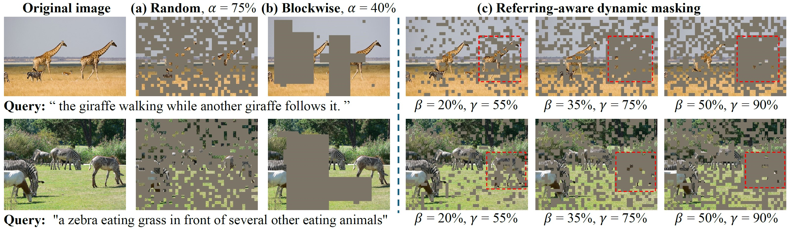

[//]: # (<br />)
<p align="center"> <h1 align="center">OneRef: Unified One-tower Expression Grounding and Segmentation with Mask Referring Modeling</h1>
  <p align="center">
    <b> NeurIPS 2024 </b>
    <br />
    <a href="https://scholar.google.com.hk/citations?user=4rTE4ogAAAAJ&hl=zh-CN&oi=sra"><strong> Linhui Xiao </strong></a>
    ·
    <a href="https://yangxs.ac.cn/home"><strong>Xiaoshan Yang </strong></a>
    ·
    <a href="https://scholar.google.com.hk/citations?user=HBZ9plsAAAAJ&hl=zh-CN"><strong>Fang Peng </strong></a>
    ·
    <a href="https://scholar.google.com.hk/citations?user=o_DllmIAAAAJ&hl=zh-CN"><strong>Yaowei Wang </strong></a>
    ·
    <a href="https://scholar.google.com.hk/citations?user=hI9NRDkAAAAJ&hl=zh-CN"><strong>Changsheng Xu</strong></a>
  </p>

  <p align="center">
    <a href='https://openreview.net/pdf?id=siPdcro6uD'>
      
    </a>
    <a href='https://neurips.cc/virtual/2024/poster/93378'>
      
    </a>
    <a href='https://neurips.cc/media/PosterPDFs/NeurIPS%202024/93378.png?t=1729402553.3015864'>
      
    </a>
    <a href='https://neurips.cc/media/neurips-2024/Slides/93378_ROahXfO.pdf'>
      
    </a>
    <a href='https://arxiv.org/pdf/2410.08021'>
      
    </a>
<br />


<p align="center">  </p>

**<p align="center"> A Comparison between OneRef model and the mainstream REC/RES architectures. </p>**

This repository is the official Pytorch implementation for the paper [**OneRef: Unified One-tower Expression Grounding 
and Segmentation with Mask Referring Modeling**](https://openreview.net/pdf?id=siPdcro6uD), which is an advanced version
of our preliminary work **HiVG** ([Publication](https://dl.acm.org/doi/abs/10.1145/3664647.3681071), [Paper](https://openreview.net/pdf?id=NMMyGy1kKZ), 
[Code](https://github.com/linhuixiao/HiVG)) and **CLIP-VG** ([Publication](https://ieeexplore.ieee.org/abstract/document/10269126),
[Paper](https://arxiv.org/pdf/2305.08685), [Code](https://github.com/linhuixiao/CLIP-VG)). 

If you have any questions, please feel free to open an issue or contact me with emails: <xiaolinhui16@mails.ucas.ac.cn>.
Any kind discussions are welcomed!

**Please leave a <font color='orange'>STAR ⭐</font> if you like this project!**

## News

- :fire: **Update on 2025/07/30:** **All of the code and models have been released!**

  :exclamation: During the code tidying process, some bugs may arise due to changes in variable names. If any issues occur, please raise them in the [issue page](https://github.com/linhuixiao/OneRef/issues), and I will try to resolve them timely.

- :fire: **Update on 2024/12/28: We conducted a Survey of Visual Grounding over the past decade, entitled "Towards Visual Grounding: A Survey" ([Paper](https://arxiv.org/pdf/2412.20206), [Project](https://github.com/linhuixiao/Awesome-Visual-Grounding)), Comments are welcome !!!**
- :fire: **Update on 2024/10/10: Our grounding work **OneRef** ([paper](https://arxiv.org/abs/2410.08021), [Code](https://github.com/linhuixiao/OneRef)) has been accepted by the top conference NeurIPS 2024 !**
- **Update on 2024/07/16:** **Our grounding work HiVG ([Publication](https://dl.acm.org/doi/abs/10.1145/3664647.3681071), [Paper](https://openreview.net/pdf?id=NMMyGy1kKZ), [Code](https://github.com/linhuixiao/HiVG)) has been accepted by the top conference ACM MM 2024 !**
- **Update on 2023/9/25:** **Our grounding work CLIP-VG ([paper](https://ieeexplore.ieee.org/abstract/document/10269126), [Code](https://github.com/linhuixiao/CLIP-VG)) has been accepted by the top journal IEEE Transaction on Multimedia (2023)!** 


## Citation

If you find our work helpful for your research, please consider citing the following BibTeX entry.   

```bibtex
@inproceedings{xiao2024oneref,
  title={OneRef: Unified One-tower Expression Grounding and Segmentation with Mask Referring Modeling},
  author={Xiao, Linhui and Yang, Xiaoshan and Peng, Fang and Wang, Yaowei and Xu, Changsheng},
  booktitle={Proceedings of the 38th International Conference on Neural Information Processing Systems},
  year={2024}
}
```

<h3 align="left">
Links: 
<a href="https://arxiv.org/abs/2410.08021">ArXiv</a>, 
<a href="https://neurips.cc/virtual/2024/poster/93378">NeurIPS 2024</a>
</h3>


## TODO

[//]: # (The code is currently being tidied up, and both the code and model will be made publicly available soon!)

All the code and models for this paper have been released! 

- [x] Release all the checkpoints.
- [x] Release the full model code, training and inference code.


## Contents

1. [Introduction](#introduction)
2. [Usage](#usage)
3. [Results](#results)
4. [Contacts](#contacts)
5. [Acknowledgments](#acknowledgments)


## Highlight

- **(i) We pioneer the application of mask modeling to referring tasks by introducing a novel paradigm called mask referring modeling.** This paradigm
effectively models the referential relation between visual and language. 
- **(ii) Diverging from previous works, we propose a remarkably concise one-tower framework for grounding and referring 
segmentation in a unified modality-shared feature space.** Our model eliminates the commonly used modality 
interaction modules, modality fusion en-/decoders, and special grounding tokens. 
- **(iii) We extensively validate the effectiveness of OneRef in three referring tasks on five datasets.** Our method consistently
surpasses existing approaches and achieves SoTA performance across several settings, providing a
valuable new insights for future grounding and referring segmentation research.


## Introduction

Constrained by the separate encoding of vision and language, existing grounding
and referring segmentation works heavily rely on bulky Transformer-based fusion
en-/decoders and a variety of early-stage interaction technologies. Simultaneously,
the current mask visual language modeling (MVLM) fails to capture the nuanced
referential relationship between image-text in referring tasks. In this paper, we
propose **OneRef, a minimalist referring framework built on the modality-shared
one-tower transformer that unifies the visual and linguistic feature spaces**. To
modeling the referential relationship, we introduce a novel **MVLM paradigm** called
**Mask Referring Modeling (MRefM)**, which encompasses both referring-aware
mask image modeling and referring-aware mask language modeling. Both modules not 
only reconstruct modality-related content but also cross-modal referring
content. Within MRefM, we propose a referring-aware dynamic image masking
strategy that is aware of the referred region rather than relying on fixed ratios
or generic random masking schemes. By leveraging the unified visual language
feature space and incorporating MRefM’s ability to model the referential relations,
our approach enables direct regression of the referring results without resorting
to various complex techniques. Our method consistently surpasses existing approaches
and achieves SoTA performance on both grounding and segmentation
tasks, providing valuable insights for future research.

For more details, please refer to [our paper](https://openreview.net/pdf?id=siPdcro6uD).


## Usage
### Dependencies
- Python 3.9.10
- PyTorch 2.0.1
- timm 0.6.13
- Check [requirements.txt](requirements.txt) for other dependencies. 

Our environment is aligned with Beit-3. Besides, our model is **easy to deploy** in a variety of environments and **has been successfully tested** on multiple pytorch versions.


### Image Data Preparation
1.You can download the images from the original source and place them in your disk folder, such as `$/path_to_image_data`:
- [MS COCO 2014](download_mscoco2014.sh) (for RefCOCO, RefCOCO+, RefCOCOg dataset, almost 13.0GB) 
- [ReferItGame](https://drive.google.com/drive/folders/1D4shieeoKly6FswpdjSpaOrxJQNKTyTv)
- [Flickr30K Entities](http://shannon.cs.illinois.edu/DenotationGraph/#:~:text=make%20face-,Downloads,-Please%20fill%20in)

   We provide a script to download the mscoco2014 dataset, you just need to run the script in terminal with the following command:
   ```
   bash download_mscoco2014.sh
   ```
   Or you can also follow the data preparation of TransVG, which can be found in [GETTING_STARTED.md](https://github.com/djiajunustc/TransVG/blob/main/docs/GETTING_STARTED.md).

Only the image data in these datasets is used, and these image data is easily find in similar repositories of visual grounding work, such as [TransVG](https://github.com/linhuixiao/TransVG) etc. 
Finally, the `$/path_to_image_data` folder will have the following structure:

```angular2html
|-- image_data
   |-- Flickr30k
      |-- flickr30k-images
   |-- other
      |-- images
        |-- mscoco
            |-- images
                |-- train2014
   |-- referit
      |-- images
```
- ```$/path_to_image_data/image_data/Flickr30k/flickr30k-images/```: Image data for the Flickr30K dataset, please download from this [link](http://shannon.cs.illinois.edu/DenotationGraph/#:~:text=make%20face-,Downloads,-Please%20fill%20in). Fill the form and download the images.
- ```$/path_to_image_data/image_data/other/images/```: Image data for RefCOCO/RefCOCO+/RefCOCOg, i.e., mscoco2014. 
- ```$/path_to_image_data/image_data/referit/images/```: Image data for ReferItGame.

## Text-Box Anotations 
The labels in the fully supervised scenario is consistent with previous works such as [CLIP-VG](https://github.com/linhuixiao/CLIP-VG).

:star: As we need to conduct pre-training with mixed datasets, we have shuffled the order of the datasets and unified 
some of the dataset formats. You need to download our text annotation files from the [HuggingFace homepage](https://huggingface.co/xiaolinhui/OneRef/tree/main/text_box_annotation).

### Fully supervised setting
<table>
    <tr> <!-- line 3 -->
    <th style="text-align:center" > Datasets </th>
    <th style="text-align:center" > RefCOCO </th>
    <th style="text-align:center" > RefCOCO+ </th>
    <th style="text-align:center" > RefCOCOg-g </th>
    <th style="text-align:center" > RefCOCOg-u </th>
    <th style="text-align:center" > ReferIt </th>
    <th style="text-align:center" > Flickr </th>
    <th style="text-align:center" > mixup_with_refc </th>
    <th style="text-align:center" > mixup_with_refc_referit </th>
    </tr>
    <tr> <!-- line 2 -->
        <th style="text-align:center" rowspan="1"> url, size </th> <!-- table head -->
        <th style="text-align:center" colspan="8"> <a href="https://huggingface.co/xiaolinhui/OneRef/tree/main/text_box_annotation">All of six datasets</a>,  89.0MB </th>  <!-- table head -->
</tr>
</table>

\* The `mixup_with_refc` denotes the mixup of the training data from RefCOCO/+/g-umd (without use gref), which used in RES task. The `mixup_with_refc_referit` denotes the 
mixup of the training data from RefCOCO/+/g (without use gref) and ReferIt Game, which used in REC task. The val and test split of both Mixup1
and Mixup2 are used the val and testA file from RefCOCOg. <u>The training data in RefCOCOg-g (i.e., gref) exist data leakage.</u>


Download the above annotations to a disk directory such as `$/path_to_split`; then will have the following similar directory structure:

```angular2html
|-- /full_sup_data
    ├── flickr
    │   ├── flickr_test.pth
    │   ├── flickr_train.pth
    │   └── flickr_val.pth
    ├── gref
    │   ├── gref_train.pth
    │   └── gref_val.pth
    ├── gref_umd
    │   ├── gref_umd_test.pth
    │   ├── gref_umd_train.pth
    │   └── gref_umd_val.pth
    ├── mixup_with_refc
    │   ├── mixup_test.pth
    │   ├── mixup_train.pth
    │   └── mixup_val.pth
    ├── mixup_with_refc_referit
    │   ├── mixup_test.pth
    │   ├── mixup_train.pth
    │   └── mixup_val.pth
    ├── referit
    │   ├── referit_test.pth
    │   ├── referit_train.pth
    │   └── referit_val.pth
    ├── unc
    │   ├── unc_testA.pth
    │   ├── unc_testB.pth
    │   ├── unc_train.pth
    │   └── unc_val.pth
    └── unc+
        ├── unc+_testA.pth
        ├── unc+_testB.pth
        ├── unc+_train.pth
        └── unc+_val.pth
```


## Pre-trained Checkpoints


The checkpoints include the <font color=Red>**Base model**</font> and <font color=Red>**Large model**</font> 
under the <font color=Red>**single-dataset fine-tuning**</font> setting and <font color=Red>**dataset-mixed 
grounding pretraining**</font> setting with **Both** <font color=Red>**REC**</font> and <font color=Red>**RES**</font> tasks. 

**<font color=Orange>It should be noted that OneRef involves 25 models with a total size of 125GB, and we have made all of these 25 models 
open source</font>. We ensure that these models can reproduce the results in the paper. If these models fail to reproduce 
the results or encounter errors, please contact us promptly via email or by raising an issue. 
We will check and upload the correct models. This might be due to model upload errors or model corruption 
during disk storage. After all, we trained nearly a hundred models during the research course of this work.**

<a href="https://huggingface.co/xiaolinhui/OneRef/tree/main"><picture><source media="(prefers-color-scheme: dark)" srcset="https://raw.githubusercontent.com/lobehub/lobe-icons/refs/heads/master/packages/static-png/dark/huggingface-color.png" /></picture><br/>HuggingFace： 
All the models are publicly available on the [**OneRef Huggingface homepage**](https://huggingface.co/xiaolinhui/OneRef/tree/main). You can freely download the corresponding models on this website.

### REC task: Single-dataset fine-tuning checkpoints download

<table>
    <tr> <!-- line 3 -->
    <th style="text-align:center" > Datasets </th>
    <th style="text-align:center" > RefCOCO </th>
    <th style="text-align:center" > RefCOCO+ </th>
    <th style="text-align:center" > RefCOCOg-u </th>
    <th style="text-align:center" > ReferIt </th>
    <th style="text-align:center" > Flickr </th>
    </tr> 
    <tr> <!-- line 2 -->
        <th style="text-align:center" rowspan="1"> Base model </th> <!-- table head -->
        <th style="text-align:center" colspan="6"> <a href="https://drive.google.com/file/d/1C64fr7X-snTvZ8MlccPmYZOlkAOhlYpF/view?usp=drive_link"> Google Drive, rec_single_dataset_finetuning_base.zip (for all), ~9.0 GB </a>  </th>  <!-- table head -->
    </tr>
    <tr> <!-- line 2 -->
        <th style="text-align:center" rowspan="1"> Base model </th> <!-- table head -->
        <th style="text-align:center" colspan="6"> <a href="https://huggingface.co/xiaolinhui/OneRef/blob/main/rec_single_dataset_finetuning_base.zip"> Hugging Face, rec_single_dataset_finetuning_base.zip (for all), ~9.0 GB </a>  </th>  <!-- table head -->
    </tr>
    <tr> <!-- line 2 -->
        <th style="text-align:center" rowspan="1"> Large model </th> <!-- table head -->
        <th style="text-align:center" colspan="1"> <a href="https://huggingface.co/xiaolinhui/OneRef/blob/main/rec_single_dataset_finetuning_large_unc.pth">finetuning_large_unc, ~8.0 GB </a>  </th>  <!-- table head -->
        <th style="text-align:center" colspan="1"> <a href="https://huggingface.co/xiaolinhui/OneRef/blob/main/rec_single_dataset_finetuning_large_unc%2B.pth">finetuning_large_unc+, ~8.0 GB </a>  </th>  <!-- table head -->
        <th style="text-align:center" colspan="1"> <a href="https://huggingface.co/xiaolinhui/OneRef/blob/main/rec_single_dataset_finetuning_large_gref_umd.pth">finetuning_large_gref_umd, ~8.0 GB </a>  </th>  <!-- table head -->
        <th style="text-align:center" colspan="1"> <a href="https://huggingface.co/xiaolinhui/OneRef/blob/main/rec_single_dataset_finetuning_large_referit.pth">finetuning_large_referit, ~8.0 GB </a>  </th>  <!-- table head -->
        <th style="text-align:center" colspan="1"> <a href="https://huggingface.co/xiaolinhui/OneRef/blob/main/rec_single_dataset_finetuning_large_flickr.pth">finetuning_large_flickr, ~8.0 GB </a>  </th>  <!-- table head -->
    </tr>
</table>


### REC task: Mixup grounding pre-training checkpoints download

<table>
    <tr> <!-- line 3 -->
    <th style="text-align:center" > Datasets </th>
    <th style="text-align:center" > Mixup (RefCOCO/+/g) </th>
    <th style="text-align:center" > ReferIt </th>
    <th style="text-align:center" > Flickr </th>
</tr>
    <tr> <!-- line 2 -->
        <th style="text-align:center" rowspan="1"> base model </th> <!-- table head -->
        <th style="text-align:center" colspan="3"> <a href="https://huggingface.co/xiaolinhui/OneRef/blob/main/rec_mixup_grounding_pretraining_base.zip">rec_mixup_grounding_pretraining_base.zip, ~6.0 GB </a>  </th>  <!-- table head -->
    </tr>
    <tr> <!-- line 3 -->
    <th style="text-align:center" > Large model </th>
    <th style="text-align:center" > <a href="https://huggingface.co/xiaolinhui/OneRef/blob/main/rec_mixup_grounding_pretraining_large_unc%2Bg.pth">mixup_pretraining_large_unc+g, ~8.0 GB</a> </th>
    <th style="text-align:center" > <a href="https://huggingface.co/xiaolinhui/OneRef/blob/main/rec_mixup_grounding_pretraining_large_referit.pth">mixup_pretraining_large_referit, ~8.0 GB</a> </th>
    <th style="text-align:center" > <a href="https://huggingface.co/xiaolinhui/OneRef/blob/main/rec_mixup_grounding_pretraining_large_flickr.pth">mixup_pretraining_large_flickr, ~8.0 GB</a> </th>
    </tr>
</table>

### RES task: Single-dataset fine-tuning checkpoints download

<table>
    <tr> <!-- line 3 -->
    <th style="text-align:center" > Datasets </th>
    <th style="text-align:center" > RefCOCO </th>
    <th style="text-align:center" > RefCOCO+ </th>
    <th style="text-align:center" > RefCOCOg-u </th>
    </tr>
    <tr> <!-- line 2 -->
        <th style="text-align:center" rowspan="1"> base model </th> <!-- table head -->
        <th style="text-align:center" colspan="3"> <a href="https://huggingface.co/xiaolinhui/OneRef/blob/main/res_single_dataset_finetuning_base.zip"> res_single_dataset_finetuning_base.zip, ~6.0 GB </a>  </th>  <!-- table head -->
    </tr>
    <tr> <!-- line 2 -->
        <th style="text-align:center" rowspan="1"> Large model </th> <!-- table head -->
        <th style="text-align:center" colspan="1"> <a href="https://huggingface.co/xiaolinhui/OneRef/blob/main/res_single_dataset_finetuning_large_unc.pth">finetuning_large_unc, ~8.0 GB </a>  </th>  <!-- table head -->
        <th style="text-align:center" colspan="1"> <a href="https://huggingface.co/xiaolinhui/OneRef/blob/main/res_single_dataset_finetuning_large_unc%2B.pth">finetuning_large_unc+, ~8.0 GB </a>  </th>  <!-- table head -->
        <th style="text-align:center" colspan="1"> <a href="https://huggingface.co/xiaolinhui/OneRef/blob/main/res_single_dataset_finetuning_large_gref_umd.pth">finetuning_large_gref_umd, ~8.0 GB </a>  </th>  <!-- table head -->
    </tr>
</table>


### RES task: Mixup grounding pre-training checkpoints download

<table>
    <tr> <!-- line 3 -->
    <th style="text-align:center" > Datasets </th>
    <th style="text-align:center" > Mixup (RefCOCO/+/g) </th>
    </tr>
    <tr> <!-- line 2 -->
        <th style="text-align:center" rowspan="1"> base model </th> <!-- table head -->
        <th style="text-align:center" colspan="1"> <a href="https://huggingface.co/xiaolinhui/OneRef/blob/main/res_mixup_grounding_pretraining_base.zip">res_mixup_pretraining_base.zip, ~1.0 GB </a>  </th>  <!-- table head -->
    </tr>
    <tr> <!-- line 3 -->
    <th style="text-align:center" > Large model </th>
    <th style="text-align:center" > <a href="https://huggingface.co/xiaolinhui/OneRef/blob/main/res_mixup_grounding_pretraining_large_unc_%2B_g.pth">res_mixup_pretraining_large, ~2.0 GB</a> </th>
    </tr>
</table>


After downloading all of these checkpoints, you can save them in the following directory, allowing you to train and test 
the five datasets at once and just using a single script.

```angular2html
|-- /finetuning_checkpoints (base or large model, rec or res task)
    ├── flickr
    │   └── best_checkpoint.pth
    ├── gref_umd
    │   └── best_checkpoint.pth
    ├── referit
    │   └── best_checkpoint.pth
    ├── unc
    │   └── best_checkpoint.pth
    └── unc+
        └── best_checkpoint.pth

|-- /mixup_grounding_pretraining (base or large model, rec or res task)
    └── mixup
        └── best_checkpoint.pth
```


### MRefM pretrained backbone checkpoints download


 We propose our multimodal **Mask Referring Modeling (MRefM)** paradigm to enhance the model's referring comprehension ability. 
 Since MRefM aims to improve its general referring comprehension ability through pre-training, it mainly demonstrates its 
 performance gain under the mixed pre-training setting. In the experiment, the MRefM pre-training **for the REC task** is 
 mainly carried out through a mixture of the RefCOCO/+/g (short as RefC) and ReferIt datasets. To ensure a fair comparison,
 the MRefM pre-training **for the RES task** is mainly carried out through a mixture of the RefC datasets. 
 
For MRefM pre-training, the base model took 15 hours on 32 NVIDIA A100 GPUs, while the large model took 50 hours on 
the same number of GPUs. We provide the MRefM pre-trained checkpoints at the following: All model are placed in [HuggingFace Page](https://huggingface.co/xiaolinhui/OneRef/tree/main)


<table>
    <tr> <!-- line 3 -->
    <th style="text-align:center" > MRefM Model for REC </th>
    <th style="text-align:center" > Pretraining dataset </th>
    <th style="text-align:center" > Checkpoints </th>
    </tr>
    <tr> <!-- line 2 -->
        <th style="text-align:center" rowspan="1">  Base model  </th> <!-- table head -->
        <th style="text-align:center" rowspan="1">  RefC,ReferIt </th> <!-- table head -->
        <th style="text-align:center" colspan="1"> <a href=" ">rec_mrefm_base_patch16_384, ~2 GB </a>  </th>  <!-- table head -->
    </tr>
    <tr> <!-- line 3 -->
    <th style="text-align:center" > Large model </th>
        <th style="text-align:center" rowspan="1">  RefC,ReferIt </th> <!-- table head -->
    <th style="text-align:center" > <a href=" ">rec_mrefm_large_patch16_384, ~7 GB</a> </th>
    </tr>
</table>


<table>
    <tr> <!-- line 3 -->
    <th style="text-align:center" > MRefM Model for RES </th>
    <th style="text-align:center" > Pretraining dataset </th>
    <th style="text-align:center" > Checkpoints </th>
    </tr>
    <tr> <!-- line 2 -->
        <th style="text-align:center" rowspan="1">  Base model </th> <!-- table head -->
        <th style="text-align:center" > RefC </th>
        <th style="text-align:center" colspan="1"> <a href=" ">res_mrefm_base_patch16_384, ~2 GB </a>  </th>  <!-- table head -->
    </tr>
    <tr> <!-- line 3 -->
    <th style="text-align:center" >  Large model  </th>
    <th style="text-align:center" > RefC </th>
    <th style="text-align:center" > <a href=" ">res_mrefm_base_patch16_384, ~7 GB</a> </th>
    </tr>
</table>


### Original BEiT-3 checkpoints download

In order to facilitate the reproducibility of the MRefM pre-training results and to achieve transferability in non-MRefM settings,
we also provide the original BEiT-3 model as follows. You can download it from the table below or from 
the [BEiT-3 official repository](https://github.com/microsoft/unilm/tree/master/beit3).


<table>
    <tr> <!-- line 3 -->
    <th style="text-align:center" > BEiT-3 original model </th>
    <th style="text-align:center" > Checkpoints </th>
    </tr>
    <tr> <!-- line 2 -->
        <th style="text-align:center" rowspan="1">  Sentencepiece model (Tokenizer) </th> <!-- table head -->
        <th style="text-align:center" colspan="1"> <a href="https://huggingface.co/xiaolinhui/OneRef/blob/main/beit3_checkpoints/beit3.spm">sp3 Sentencepiece model, 1 MB </a>  </th>  <!-- table head -->
    </tr>
    <tr> <!-- line 2 -->
        <th style="text-align:center" rowspan="1">  MIM VQKD model </th> <!-- table head -->
        <th style="text-align:center" colspan="1"> <a href="https://huggingface.co/xiaolinhui/OneRef/blob/main/beit3_checkpoints/vqkd_encoder_base_decoder_3x768x12_clip-d5036aa7.pth">vqkd model, 438 MB </a>  </th>  <!-- table head -->
    </tr>
    <tr> <!-- line 2 -->
        <th style="text-align:center" rowspan="1"> BEiT-3 Base model </th> <!-- table head -->
        <th style="text-align:center" colspan="1"> <a href="https://huggingface.co/xiaolinhui/OneRef/blob/main/beit3_checkpoints/beit3_base_indomain_patch16_224.pth">beit3_base_indomain_patch16_224, 554 MB </a>  </th>  <!-- table head -->
    </tr>
    <tr> <!-- line 3 -->
    <th style="text-align:center" >  BEiT-3 Large model  </th>
    <th style="text-align:center" > <a href="https://huggingface.co/xiaolinhui/OneRef/blob/main/beit3_checkpoints/beit3_large_indomain_patch16_224.pth">beit3_large_indomain_patch16_224, 1.5 GB</a> </th>
    </tr>
</table>


## REC and RES Transfer Training and Evaluation

As shown below, we have provided complete evaluation, training, and pre-training scripts in the [train_and_eval_script](train_and_eval_script). 

```angular2html
train_and_eval_script
├── eval_rec_mixup_grounding_pretraining_base.sh
├── eval_rec_mixup_grounding_pretraining_large.sh
├── eval_rec_single_dataset_finetuning_base.sh
├── eval_rec_single_dataset_finetuning_large.sh
├── eval_res_mixup_grounding_pretraining_base.sh
├── eval_res_mixup_grounding_pretraining_large.sh
├── eval_res_single_dataset_finetuning_base.sh
├── eval_res_single_dataset_finetuning_large.sh
├── MRefM_pretraining
│   ├── rec_mrefm_pretraining_base.sh
│   ├── rec_mrefm_pretraining_large.sh
│   ├── res_mrefm_pretraining_base.sh
│   └── res_mrefm_pretraining_large.sh
├── submit_for_multi_node_pretraining
│   ├── get_master_ip.sh
│   ├── master_ip.sh
│   └── train_and_eval_for_multi_node.sh
├── train_rec_mixup_grounding_pretraining_base.sh
├── train_rec_mixup_grounding_pretraining_large.sh
├── train_rec_single_dataset_finetuning_base.sh
├── train_rec_single_dataset_finetuning_large.sh
├── train_res_mixup_grounding_pretraining_base.sh
├── train_res_mixup_grounding_pretraining_large.sh
├── train_res_single_dataset_finetuning_base.sh
└── train_res_single_dataset_finetuning_large.sh
```

You only need to modify the corresponding paths (change ```$/path_to_split```, ``` $/path_to_image_data```, ``` $/path_to_output``` to your own file directory), 
and then execute the corresponding scripts with the ```bash``` command to test and train the relevant models. 

1. Training on RefCOCO with single dataset finetuning setting. 
    
    ```
    CUDA_VISIBLE_DEVICES=3,4,5,6,7 python -m torch.distributed.launch --nproc_per_node=5 --master_port 28887 --use_env train_clip_vg.py --num_workers 32 --epochs 120 --batch_size 64 --lr 0.00025  --lr_scheduler cosine --aug_crop --aug_scale --aug_translate    --imsize 224 --max_query_len 77  --sup_type full --dataset unc      --data_root $/path_to_image_data --split_root $/path_to_split --output_dir $/path_to_output/output_v01/unc;
    ```
    Please refer to [train_and_eval_script/train_rec_single_dataset_finetuning_base.sh](train_and_eval_script/train_rec_single_dataset_finetuning_base.sh) for training commands on other datasets.

2. Evaluation on RefCOCO. 
    ```
    CUDA_VISIBLE_DEVICES=2,3,4,5,6,7 python -m torch.distributed.launch --nproc_per_node=6 --master_port 28888 --use_env eval.py --num_workers 2 --batch_size 128    --dataset unc      --imsize 224 --max_query_len 77 --data_root $/path_to_image_data --split_root $/path_to_split --eval_model $/path_to_output/output_v01/unc/best_checkpoint.pth      --eval_set val    --output_dir $/path_to_output/output_v01/unc;
    ```
    Please refer to [train_and_eval_script/eval_rec_single_dataset_finetuning_base.sh](train_and_eval_script/eval_rec_single_dataset_finetuning_base.sh) for evaluation commands on other splits or datasets.
    
3. We strongly recommend to use the ```bash``` commands to training or testing with different datasets and splits, 
    which will significant reduce the training workforce. such as:
    ```
    bash train_and_eval_script/train_rec_single_dataset_finetuning_base.sh
    ```

 **It should be noted that**, due to the limited number of data samples in the single-dataset setting, MRefM did not yield significant improvements in performance. To streamline the training process and facilitate the reproducibility of our work, we provide a training process without MRefM pre-training specifically for the single-dataset scenario.


## MRefM Pre-training

### 1. One-node Pre-training
   Single-node means that only one multi-card server is needed. You just need to run the following command. This training is not much different from the fine-tuning training.

    CUDA_VISIBLE_DEVICES=3,4,5,6,7 python -m torch.distributed.launch --nproc_per_node=5 --master_port 28887 --use_env train_clip_vg.py --num_workers 32 --epochs 120 --batch_size 64 --lr 0.00025  --lr_scheduler cosine --aug_crop --aug_scale --aug_translate    --imsize 224 --max_query_len 77  --sup_type full --dataset unc      --data_root $/path_to_image_data --split_root $/path_to_split --output_dir $/path_to_output/output_v01/unc;

   Or using the bash command as follows:

```angular2html
bash train_and_eval_script/MRefM_pretraining/rec_mrefm_pretraining_base.sh
```

### 2. Multi-node Pre-training

 Multi-node training means that multiple multi-card servers are required. You need to use the scripts in the [train_and_eval_script/submit_for_multi_node_pretraining](train_and_eval_script/submit_for_multi_node_pretraining) directory to start the process on multiple servers. For detailed operations, you can refer to the relevant tutorials.

## Results

### 1. REC task
<details open>
<summary><font size="4">
REC Single-dataset Fine-tuning SoTA Result Table
</font></summary>

</details>

<details open>
<summary><font size="4">
REC Dataset-mixed Pretraining SoTA Result Table
</font></summary>

</details>

### 2. RES task

<details open>
<summary><font size="4">
RES Single-dataset Fine-tuning and Dataset-mixed Pretraining SoTA Result Table (mIoU)
</font></summary>

</details>


<details open>
<summary><font size="4">
RES Single-dataset Fine-tuning and Dataset-mixed Pretraining SoTA Result Table (oIoU)
</font></summary>

</details>

### 3. Our model also has significant energy efficiency advantages.

<details open>
<summary><font size="4">
Comparison of the computational cost in REC task.
</font></summary>
<div align=center>
</div>
</details>


## Methods 

<p align="center">  </p>

**<p align="center"> An Illustration of our multimodal Mask Referring Modeling (MRefM) paradigm, which
includes Referring-aware mask image modeling and Referring-aware mask language modeling. </p>**


<p align="center">  </p>

**<p align="center">  An Illustration of the referring-based grounding and segmentation transfer. </p>**

<p align="center">  </p>

**<p align="center"> Illustrations of random masking (MAE) [27], block-wise masking (BEiT) [4], and our
referring-aware dynamic masking. α denotes the entire masking ratio, while β and γ denote the
masking ratio beyond and within the referred region. </p>**


## Visualization
<p align="center">  </p>
  
**<p align="center">  Qualitative results on the RefCOCO-val dataset. </p>**

<p align="center">  </p>
  
**<p align="center">  Qualitative results on the RefCOCO+-val dataset. </p>**

<p align="center">  </p>
  
**<p align="center">  Qualitative results on the RefCOCOg-val dataset. </p>**

Each example shows two different query texts. From left to right: the original input image, the ground truth with
box and segmentation mask (in green), the RES prediction of OneRef (in cyan), the REC prediction
of OneRef (in cyan), and the cross-modal feature.


## Contacts
Email: <xiaolinhui16@mails.ucas.ac.cn>.
Any kind discussions are welcomed!

## Acknowledgement

Our model is related to [BEiT-3](https://github.com/microsoft/unilm/tree/master/beit3) and 
[MAE](https://github.com/facebookresearch/mae). Thanks for their great work!

We also thank the great previous work including [TransVG](https://github.com/linhuixiao/TransVG), 
[DETR](https://github.com/facebookresearch/detr), [CLIP](https://github.com/openai/CLIP), 
[CLIP-VG](https://github.com/linhuixiao/CLIP-VG), etc. 

Thanks [Microsoft](https://github.com/microsoft/unilm) for their awesome models.


## Star History

[](https://star-history.com/#linhuixiao/OneRef&Date)


